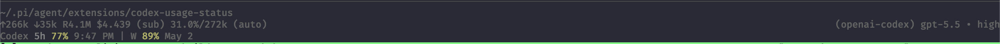

# Codex Usage Status

Show remaining Codex usage in the Pi status line.



Codex Usage Status reads the Codex app-server rate-limit endpoint and renders the session and weekly windows. It refreshes on startup, after `/reload`, and then by turn cadence. The default cadence is every 5 turns to avoid spawning Codex on every response.

## Install

From npm:

```bash
pi install npm:@ocodista/codex-usage-status
```

From GitHub:

```bash
pi install git:github.com/ocodista/codex-usage-status
```

For a private GitHub repo, use SSH:

```bash
pi install git:git@github.com:ocodista/codex-usage-status
```

For local development:

```bash
pi install /path/to/codex-usage-status
# or run it for one session
pi -e /path/to/codex-usage-status
```

## Use

Start Pi. The status line updates immediately.

Refresh manually any time with:

```text
/codex-usage:refresh
```

Open settings with:

```text
/codex-usage-status:settings
```

Choose one refresh cadence:

- Each turn
- Every 5 turns
- Every 10 turns
- Every 20 turns
- Every 50 turns

The extension stores settings at:

```text
~/.pi/agent/extensions/codex-usage-status/settings.json
```

## How it works

The extension listens for Pi session events. It refreshes once when the session starts, including after `/reload`. You can also refresh manually with `/codex-usage:refresh`. After startup, it counts completed turns and refreshes only when the selected cadence matches.

On each refresh, it starts Codex with stdio transport:

```bash
codex app-server --listen stdio://
```

Then it sends a JSON-RPC request for account rate limits:

```json
{"method":"account/rateLimits/read","id":1,"params":null}
```

The response contains the current session and weekly windows. The extension formats those values and writes one compact status-line entry.

This does not call a model. It should not consume model tokens. The main cost is starting the Codex process and making a small account request.

## Package manifest

This package declares its Pi extension in `package.json`:

```json
{
  "keywords": ["pi-package"],
  "pi": {
    "extensions": ["./index.ts"]
  }
}
```

Pi can load it from npm, GitHub, or a local path.
