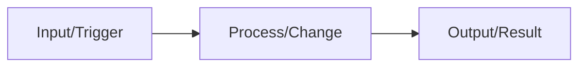
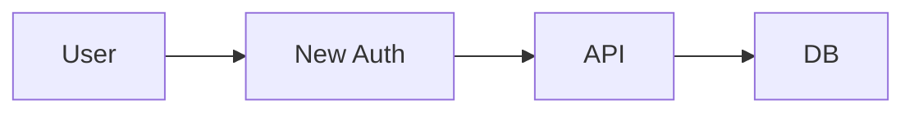
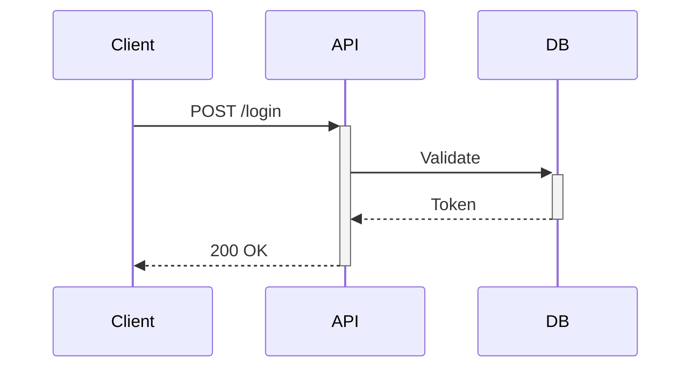

# Open Pull Request

Create and open a pull request: $ARGUMENTS

## Process

1. **Pre-flight Checks**
   - Verify current branch state and commits
   - Check if remote branch exists and is up to date
   - Review all changes that will be included in the PR

2. **Change Analysis**
   - Analyze all commits since branch diverged from main
   - Identify the scope and impact of changes
   - Ensure changes align with the intended feature/fix

3. **Push to Remote**
   - Push current branch to remote repository
   - Set up tracking if needed

4. **PR Creation**
   - Draft concise PR title and description
   - Include mermaid diagram showing the change flow
   - Add test plan with specific steps
   - Reference any related issues or tickets

## PR Body Format

```markdown
## Summary

[One sentence describing the change]



- [Key change 1]
- [Key change 2]

## Test Plan

1. [Step to verify]
2. [Step to verify]

## Notes

- [Breaking changes if any]
- [Deployment considerations if any]
```

## Mermaid Diagram Guidelines

Choose the appropriate diagram type:

- **flowchart LR**: For data/request flows, pipelines, state changes
- **sequenceDiagram**: For API calls, service interactions, async flows
- **graph LR**: For dependency changes, architecture modifications

Rules:
- Use `LR` (left-to-right) orientation for `flowchart` and `graph`
- `sequenceDiagram` has no orientation
- Max 5-7 nodes
- Use short labels (2-3 words)
- Show the delta (what changed), not entire system

Examples:





Once finished, get the PR URL and run `open <pr-url>`
